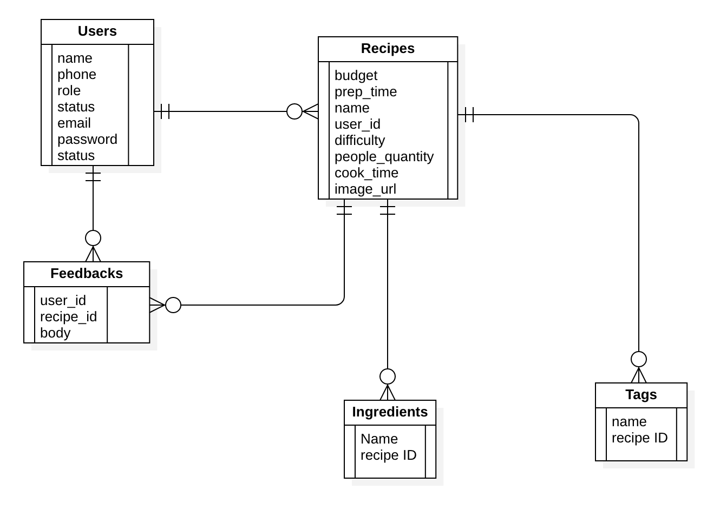
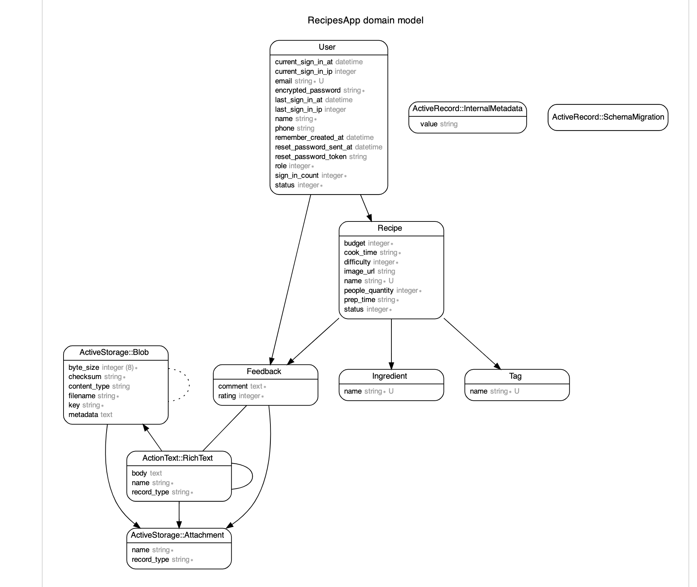

# RecipesApp

Recipes is an application that helps you find a recipe that you can prepare with what you have at home

## Target audience

- People who are proficient cooks and are just looking for an inspiration and new ideas
- People who are in need of guidance with cooking

## Live demo

[Heroku live](https://recipe-app-test.herokuapp.com/)

### Credentials

#### user:

email: `user@recipe.app`, password: `password`

#### admin:

email: `admin@recipe.app`, password: `password`

## Scope

- [Requirements](./docs/requirements.md)
- [Tasks management](https://github.com/majedbojan/recipes-app/projects/1)

### Documentation/collection

- [API Documentation](https://documenter.getpostman.com/view/1831165/UVRGD434)

- [](https://app.getpostman.com/run-collection/6ba8f1062a920ab76dd4?action=collection%2Fimport)

# Developer Guide

## Dependencies

- Ruby 3.0.1
- PostgreSQL 14+
- Node

### Setup

To start development, clone the project

```powershell
$ git clone git@github.com:majedbojan/recipes-app.git
$ cd recipes-app
```

Then run

```powershell
bundle install
```

### Seed

```powershell
$ rails db:seed
```

Note: Total recipes are 9500, please feel free to import as less as you need by changing the `NO_OF_RECIPES` value in `db/seeds.rb`

### Branches

Note: `develop` is the base branch for development, git tree should be `develop` -> `main`

### Environemtens

- `development`: Development environment
- `test`: Used for unit test
- `production`: End user environment.

### Test cases

```powershell
bundle exec rspec spec/

# Output
Finished in 2.51 seconds (files took 5.96 seconds to load)
83 examples, 0 failures
```

### DB Design

#### Basic ERD



#### Schema ERD


